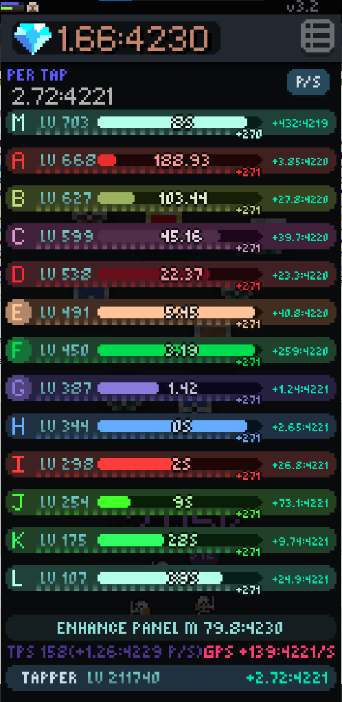
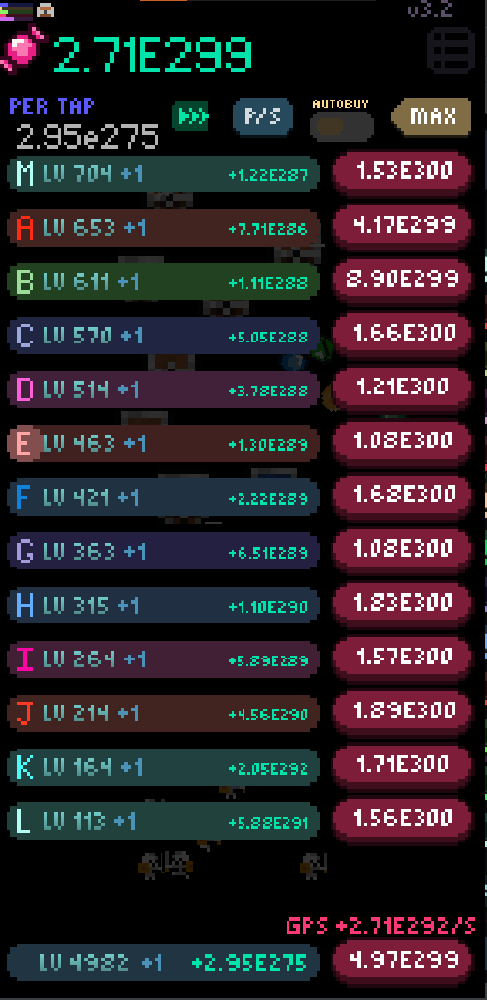

# Panels
Swiping left from the home screen will bring you to the Panels screen.  

Here you will see 13 differently coloured “panels” but you can think of them like generators because they just make money.  
On this screen you can see those informations: level of the panel, enchantment level (squares under the progress bar), time it takes to finish panel cycle, and income.  
You can change displayed income by clicking P/C or P/S under menu button on the right top of the screen, P/C stands for “Profit Per Cycle” with shows how much money you will earn every complete cycle on a panel, and P/S with means “Profit Per Second” with is self explanatory.
After swiping left one more time you will get to upgrade menu and you will see numbers on the edge on the screen, those are the prices of the upgrades.  
You can upgrade your panels and tapper on that screen.  
Upgrading any of those will increase it’s income, upgrading any on those enough times you will unlock milestones substantially increasing your income.
You can automate your panels by purchasing upgrade randomly found in the upgrade screen accessed by scrolling right from home screen. After getting automation you can further upgrade it by finding “autostarter” and “autostarter+” ability found from buying abilities.

##### !Talk about Starting Panels!
##### !Talk about enhancing panels!

[Back](Tapper%20Tab.md) | [Home](../README.md) | [Next](Upgrade%20Tab.md)