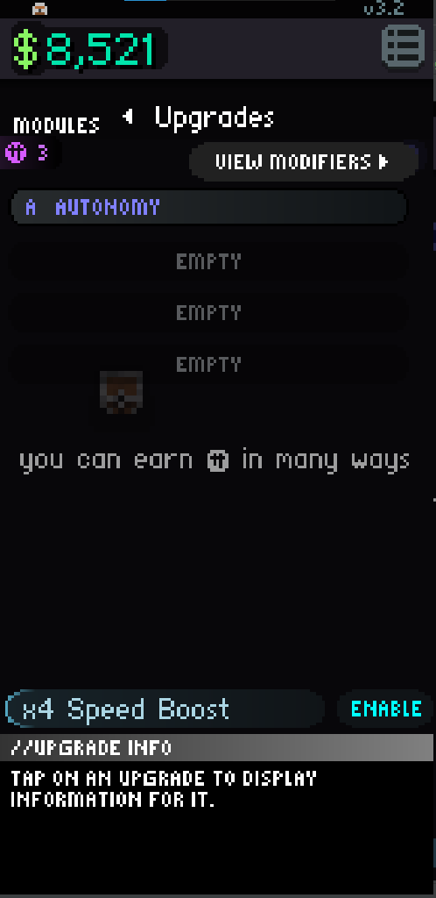

# Upgrades

Swiping right from the home screen will bring you to upgrade screen. 

You can purchase upgrades that you randomly gained during the time you've played.  
You can buy them with your credits with are shown on the left of the “view modifiers” button, or are shown temporarily on any screen after getting them.  
You can get credits from selling your equipment, upgrades, or randomly by tapping.  
There are upgrades including price reduction (multiplies price by given amount), speed upgrades (increase speed of the affected panel by x% of base speed), profit (increase panel income by a given % amount), potential units(increase potential units by % amount), taps per second or tps for short (increase your taps per second), module boost (increase the multiplier by the given amount), rarity rate (increase the rarity of the modules). 
I believe the rest of the upgrades are pretty self explanatory.

###Upgrade Rarities
White: Common
Green: Uncommon
Blue: Rare
Purple: Epic
Gold: Legendary
Red: Elite
Aqua: Ultimate

  
[Back](Panel%20Tab.md) | [Home](../README.md) | [Next](Module%20Tab.md)